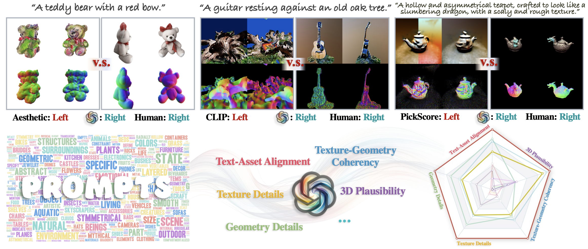

# GPTEval3D

An implementation of the paper "GPT-4V(ision) is a Human-Aligned Evaluator for Text-to-3D Generation". 
This contains an evaluation metric for text-to-3D generative models.



## Quickstart

Run `pip install gpteval3d`.

Since our work relies on GPT-4, you need to set up your OpenAI API Key for usage. You can either set it as an environment variable (`export OPENAI_API_KEY='your-api-key-here'`) or explicitly pass it as a parameter to the function.

## Evaluate Your Text-to-3D Model

### Step 1. Data Download

For a detailed explanation of the data format, please refer to [this doc](assets/data_format.md).

```bash
# TEST DATA
# 13 methods; 110 prompts; 120 uniform RGB and normal map renderings for each.
# Google Drive: https://drive.google.com/file/d/1pYmSRu_oMy_v6f7ngnkFER6PNWmJAe52/view?usp=sharing
cd data/tournament-v0
gdown "https://drive.google.com/uc?id=1pYmSRu_oMy_v6f7ngnkFER6PNWmJAe52"
unzip methods
```

### Step 2. Preparing the data

Please find the `prompts.json` file under the tournament folder (e.g. `data/tournament-v0/prompts.json`).
For each prompt listed inside, use your text-to-3D generative model to create one or more shapes per prompt.
For each of these shapes, please render 120 evenly spaced views using the camera angle chosen by the [Threestudio](https://github.com/threestudio-project/threestudio) codebase.
For each render, please aim to create 512x512 resolution.
For each render in RGB, please also create its corresponding surface normal rendering.
These renders will be provided to GPT-4V.
Finally, organize the rendered images into the following folder structure:

```bash
- data/<your_method_name>/
    # Prompt from zero
    - <prompt-id-1>/
        -<seed1>
            rgb_001.png
            ...
            rgb_119.png
            normal_001.png
            ...
            normal_119.png
    ...
```

### Step 3. Run evaluation

Once we've put our data into a format our evaluation can parse, we can run the following command to obtain the ELO score placing your method among the existing tournament.

```python
from gpteval3d.gpt_eval_alpha import score_with_existing_tournament

tournament_f = 'data/tournament-v0'
method_f = 'data/my3d'
apikey = 'your_api_key'
score_with_existing_tournament(tournament_f, method_f, apikey)
```

## Compute Scores for a Tournament

### Step 1: Organizing Data

Please organize a set of text-to-3D generative models in the following structure.

```bash
<root>
    config.json
    prompts.json
    methods/
        <method-name-1>
            <prompt-id-1>
                <seed-1>
                    rgb_0.png ...
                    normal_0.png ...   
                ...
                <seed-k>
            ...
            <prompt-id-m>
        ...
        <method-name-n>
```

For more information about what should be put into `config.json` and `prompts.json`,
please see [this link](assets/data_format.md).

### Step 2: Run Evaluation

```python
from gpteval3d.gpt_eval_alpha import score_with_existing_tournament

tournament_f = 'data/tournament-v0'
apikey = 'your_api_key'
score_with_new_tournament(tournament_f, apikey)
```

## Coming soon

- More visualization and utilities tools!
- Text-to-3D Leaderboard

## Citation

If you find our codebase useful for your research, please cite:

```bibtex
@article{wu2023gpteval3d,
  author    = {Tong Wu, Guandao Yang, Zhibing Li, Kai Zhang, Ziwei Liu, Leonidas Guibas, Dahua Lin, Gordon Wetzstein},
  title     = {GPT-4V(ision) is a Human-Aligned Evaluator for Text-to-3D Generation},
  journal={arXiv preprint arXiv:2401.04092},
  year      = {2023},
}
```
## Acknowledgement
We sincerely thank the following projects including [GPT-4V](https://chat.openai.com/), [threestudio](https://github.com/threestudio-project/threestudio), [mvdream](https://github.com/MV-Dream/MVDream), [prolificdreamer](https://github.com/thu-ml/prolificdreamer), [fantasia3d](https://github.com/Gorilla-Lab-SCUT/Fantasia3D), [point-e](https://github.com/openai/point-e), [shap-e](https://github.com/openai/shap-e), [dreamgaussian](https://github.com/dreamgaussian/dreamgaussian), [wonder3d](https://github.com/xxlong0/Wonder3D), [syncdreamer](https://github.com/liuyuan-pal/SyncDreamer) for providing their excellent codebases!
